# Version Control Systems

04/05/July/2023
# Story of an Organization LT

* LT is an organization who is developing an application for health care. Big Hospital chains are their customers
  * Appolo
  * Fortis
  * AIG

* This app helps doctors, patients, and hospital staff.
___


* Architecture of their application

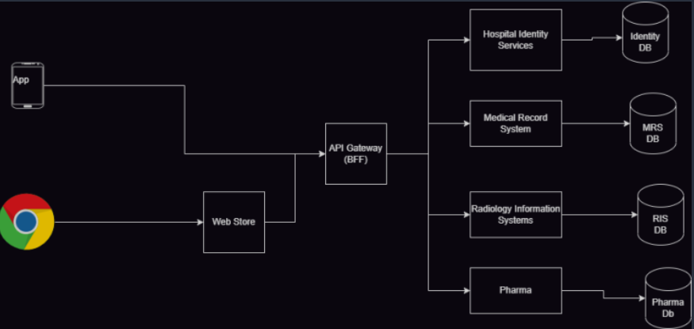 

# 🏗 2. What is Architecture?

* Architecture means:
  * How the application is designed and connected
  * Think like: 
  * School building has:
      - Classrooms
      - Office
      - Playground

* Same way:
💻 Application has:
- Different parts (services)
___

# 🧩 3. What is Microservices?

* Microservices means: Breaking one big application into **small small parts**

* Each part does **only one job**
___

### Example:

* Instead of one big system ❌  
* We create small systems ✅

| Service | Work |
|--------|------|
| Identity Service | Login & user info |
| Medical Service | Patient records |
| Radiology | Scan reports |
| Pharma | Medicines |

* 👉 Each service works independently
___

# 👥 4. Who uses the application?

Users can use:

- 📱 Mobile App
- 🌐 Website (Browser like Chrome)
___

# 🌐 5. What is Web Store?

👉 Web Store is the **frontend (UI)**

This is what user sees on screen.

Example:
- Buttons
- Forms
- Login page

---

# 🚪 6. What is API Gateway?

👉 API Gateway is like a **main gate**

All requests go through this gate.

---

### Example:

🏥 Hospital example:

- You don’t go directly to doctor
- You first go to reception

👉 Reception = API Gateway

---

### Why API Gateway is used?

- Security 🔒
- Control traffic 🚦
- Logging (record what happens)
- Single entry point

---

# 🗄 7. What is Database?

👉 Database stores data

Each service has its own database

---

### Example:

| Service | Database |
|--------|----------|
| Identity | User data |
| Medical | Patient records |
| Radiology | Scan reports |
| Pharma | Medicine data |

---

# 👨‍💻 8. Teams

👉 One team works on one service

Each team:
- Writes code
- Tests code
- Deploys code

---

# ⚙️ 9. What is DevOps?

👉 DevOps means:
**Development + Operations working together**

Goal:
- Faster work
- Less errors
- More automation

---

# 🎯 10. DevOps Goals

- Check code quality
- Find bugs early
- Automate testing
- Faster delivery
- Reduce manual work

# 🔁 11. Build Types

## 🌞 Day Build (Fast Build)

👉 Happens during the day

When developer writes code and pushes it

### What happens?
- Code is built
- Small tests run

⏱ Takes few minutes

---

## 🌙 Night Build (Full Build)

👉 Happens at night

### What happens?
- All tests run
- Full checking

⏱ Takes hours

---

# 🧪 12. Types of Testing

---

## 1. Unit Testing

👉 Testing small part of code

### Example:
Check if:
2 + 2 = 4

---

## 2. API Testing

👉 Testing backend APIs

### Example:
Request:
GET /patient/1

Response:
Patient details

---

## 3. Regression Testing

👉 Check old features still work

### Example:
- Login was working before
- After new code → still working?

---

# 🚦 13. What is Quality Gate?

👉 Rule in pipeline

If code is bad ❌  
Then build fails ❌

👉 Code cannot move forward 

---

# 🔍 14. What is Static Code Analysis?

👉 Checking code without running it

### It finds:
- Bugs 🐞
- Security issues 🔒
- Bad coding

---

### Example Tool:
- SonarQube
---

# 📦 15. What is Artifact?

👉 Artifact = Output of build

### Example:
- .jar file
- .war file
- Docker image

Think: Final package of your code

---

# 🗃 16. What is Artifact Repository?

👉 Place to store artifacts

Think:
📦 Warehouse for builds

---
### Example tools:
- Nexus
- Artifactory

---
# 🔄 17. Complete Flow (Step by Step)

### Step 1:
Developer writes code

---

### Step 2:
Code pushed to Git

---
### Step 3:
Day Build runs
- Build
- Small tests

---

### Step 4:
Artifact is created

---

### Step 5:
Artifact stored in repository

---
### Step 6:
Night Build runs
- Full testing

---

### Step 7:
Manual testers test next day

---
# 👨‍🔬 18. Manual Testing

👉 Humans test the application

They test:
- UI
- Features
- User experience

---
# 🤖 19. Automated Testing

👉 Testing using tools

No human needed

---

# 🎯 20. Final Summary

👉 Flow:

User → App → API Gateway → Services → Database

---

👉 DevOps helps to:

- Automate work
- Improve quality
- Reduce bugs
- Speed up delivery

---
---

# 🚀 21. Important Tools to Learn

- CI/CD → Jenkins, GitHub Actions
- Code Quality → SonarQube
- Artifact Storage → Nexus
- Containers → Docker
- Orchestration → Kubernetes
- Monitoring → Prometheus, Grafana

---

# ✅ Easy Real Life Example

Think of Swiggy/Zomato:

- App → You order food
- Backend → Processes order
- Restaurant → Prepares food
- Delivery → Sends to you

Same concept here with hospital system

---

# 🧠 Final Thought

👉 Break big system into small parts  
👉 Automate everything  
👉 Test early  
👉 Deliver fast  

= DevOps 🚀

# Story of an Organization (LT) – DevOps Goals
 
## 🎯 Main Goal

* The LT team wants to implement DevOps practices to improve development, testing, and delivery.
## 🔄 Daily Process

- Developers write code and commit it to the repository.
- Every time code is committed:
  - Check code quality.
  - Check for any bugs or regressions (old features breaking).

- Manual testers:
  - Test the work done by developers from the previous day.
  - Testing is done on the current day.

---

## 🔍 Code Quality

- Code quality should be checked using **Static Code Analysis tools**.
- This helps find issues in code without running it.

---
## 📦 Build & Artifacts

- Nightly builds should be created (every night).
- Build artifacts (compiled code, packages) should be stored in an **artifact repository**.

---

Every night, 3 types of testing should run automatically:

1. **System Testing** – checks full system functionality.
2. **Performance Testing** – checks speed and load handling.
3. **Security Testing** – checks for vulnerabilities.

- Test results should be shared with the team.

---

## 🗓️ Weekly Build

- Every **Friday night**, a special build runs.
- This build includes **long-duration tests**.

---

## 🚀 Release Process

- Every **2 weeks**, an internal release is created.
- This release is deployed to:
  - **UAT (User Acceptance Testing)** environment
  - **Pre-Production (Pre-Prod)** environment
- These are also called **Sprint Builds**.

---

## 🛠️ Tools & Concepts to Learn

### Version Control
- Git

### CI/CD Tool
- Jenkins, Github Actions, Azure Devops 

### Code Quality
- SonarQube (Static Code Analysis)

### Artifact Repository
- JFrog (stores build files)

### Development Strategy
- Branching strategies (how code is managed in branches)

---

## 🔗 Integrations

- Ansible (configuration management)
- Terraform (infrastructure as code)
- Docker (containerization)
- Kubernetes (container orchestration)

---

## 🔨 Build Tools

- Maven (Java projects)
- MSBuild (.NET projects)

---

## ✅ Summary

- Automate code checks and testing.
- Run nightly and weekly builds.
- Store build outputs safely.
- Test in multiple environments.
- Release updates every 2 weeks.
- Use DevOps tools to make everything faster and reliable.

# 📊 DevOps Workflow Diagram (Organization LT)

```
Developer
   │
   ▼
Code Commit (Git)
   │
   ▼
CI Pipeline (Jenkins)
   │
   ├── 🔍 Static Code Analysis (SonarQube)
   │
   ├── 🔨 Build (Maven / MSBuild)
   │
   ├── 📦 Store Artifacts (JFrog)
   │
   ▼
🌙 Nightly Build
   │
   ├── 🧪 System Testing
   ├── ⚡ Performance Testing
   ├── 🔐 Security Testing
   │
   ▼
📢 Share Test Results
   │
   ▼
🗓️ Weekly Build (Friday Night)
   │
   └── ⏳ Long Duration Tests
   │
   ▼
🚀 Bi-Weekly Release (Every 2 Weeks)
   │
   ├── UAT Environment
   └── Pre-Production Environment
   │
   ▼
⚙️ Infrastructure & Deployment
   │
   ├── Ansible
   ├── Terraform
   ├── Docker
   └── Kubernetes
```

---
# Version Control Systems

* A Version Control System (VCS) is: A tool that helps you:
  
  * Store your code
  * Track changes (who changed what, when)
  * Go back to old versions if something breaks
  * Work with a team without conflict

* Simple example: 
 
  * Think of it like:
      * Google Docs history
      * You can see old versions and restore them

## 2. Evolution of Version Control Systems

1️⃣ Single System VCS

   * Everything is stored in one computer only

 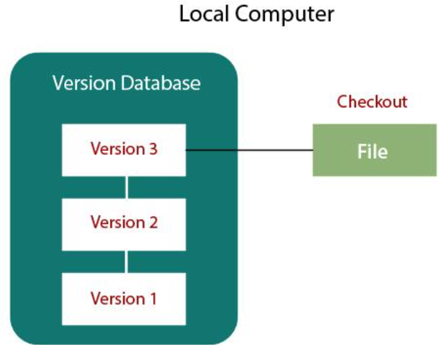

Problems:

  * If system crashes → all code lost
  * No team collaboration

2️⃣ Client-Server VCS (Centralized)

Examples:

  * Subversion (SVN)
  * Visual SourceSafe
  * ClearCase
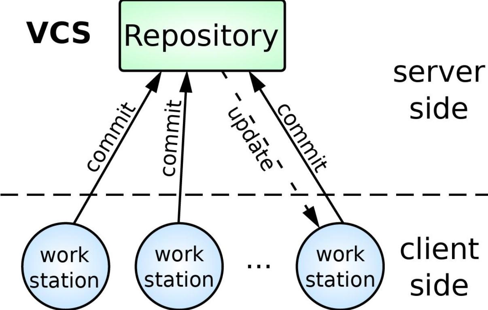

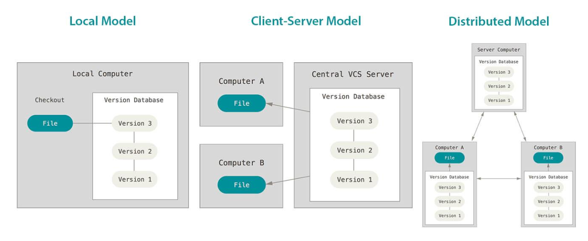

👉 There is one central server

👉 Developers connect to it

✔ Pros: 
  * Easy control
  * Everyone uses same central repo

❌ Problems:

  * Server down = no work
  * Internet required
  * Limited offline work

3️⃣ Distributed VCS (Git, Mercurial)

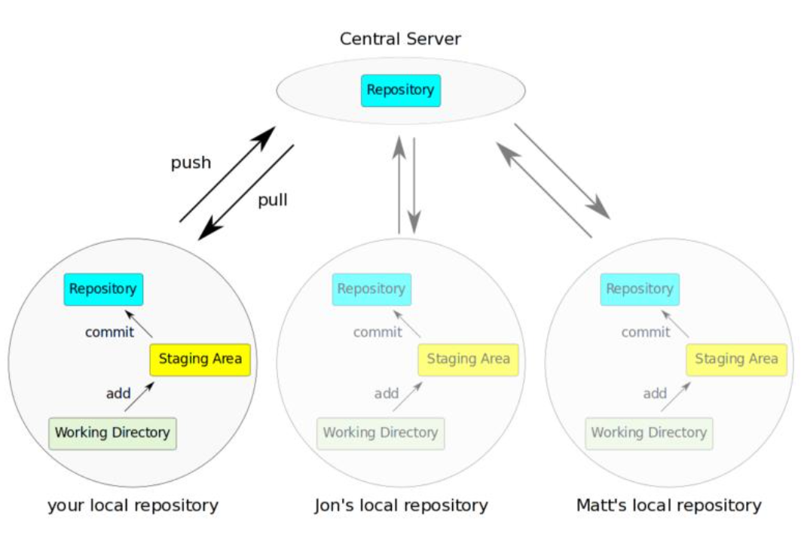

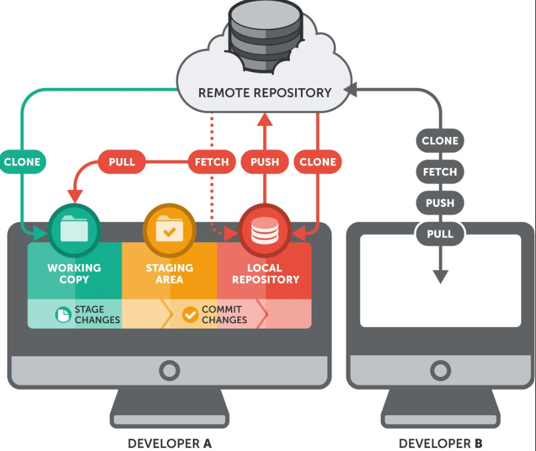

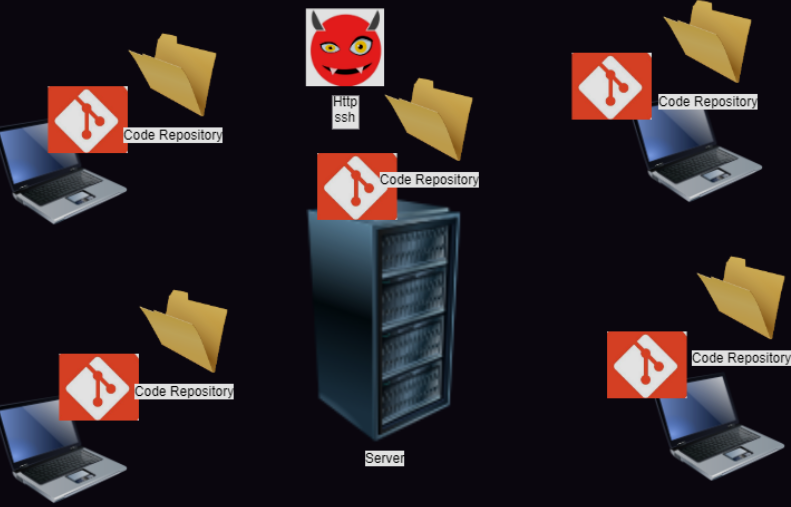

👉 Each developer has:

* Full copy of repo
* Full history

✔ Pros:

  * Work offline
  * Fast
  * No single point of failure

* Best for DevOps 

👉 Examples:

  * Git (most popular)
  * Mercurial 

🔹 3. What is Git?

* 👉 Git is a Distributed Version Control System
* ✔ Created by: Linus Torvalds
* ✔ Used everywhere in DevOps

👉 Helps in:
  * Code tracking
  * Team collaboration
  * CI/CD pipelines

🔹 4. Git Architecture (VERY IMPORTANT)

* Git has 5 areas, but we focus on 3:

🔥 Main 3 Areas

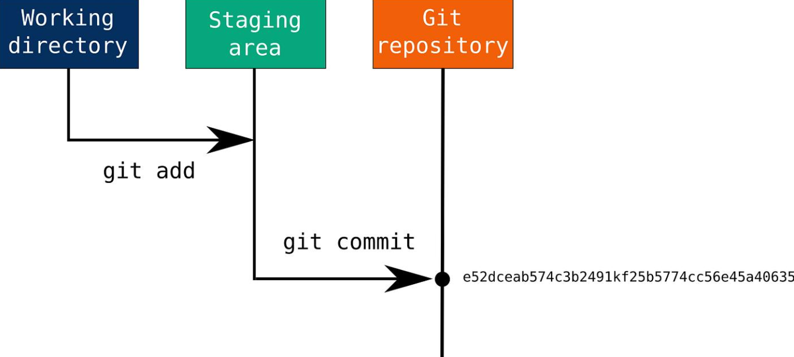

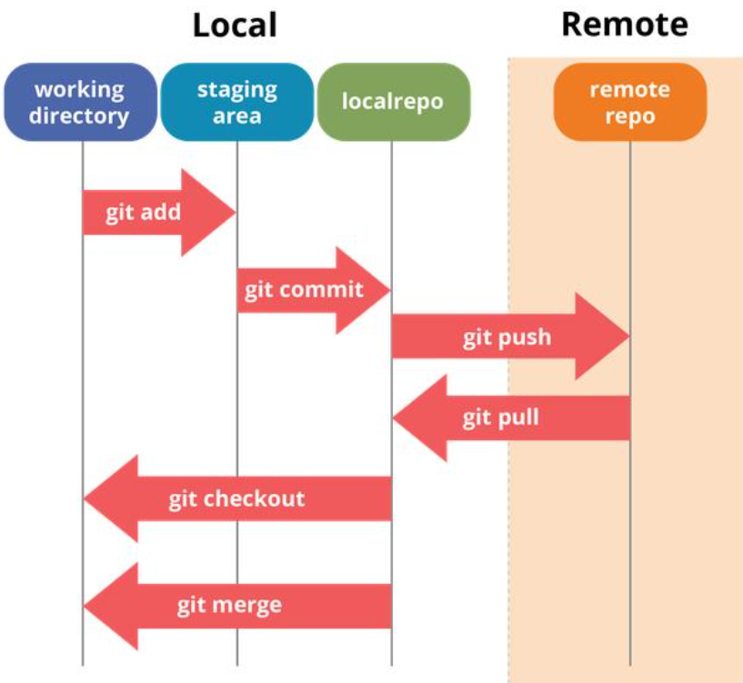

1️⃣ Working Directory (Working Tree)

* 👉 This is your actual project folder
* ✔ You:
      * Create files
      * Edit files
      * Delete files

* 📌 Example:

```yml
index.html
app.js
style.css
```

2️⃣ Staging Area (Index)

* Temporary area before commit
* You select what changes to save
* commands:

```yml
git add file_name
```
* Think like: ```Shopping cart before checkout```

3️⃣ Local Repository

* 👉 Stored inside `.git` folder

* 👉 Final saved version of your code

* Command: `git commit -m "your message whatever you want to write here" `

* Think like: `Final saved snapshot`

* 🔥 Simple Flow (Important for interview)

```yml
Working Directory → Staging Area → Local Repository
       edit            git add          git commit
```

## Real-life Example (Books analogy)
* Working Directory → Books lying on table
* Staging Area → Books packed in box
* Local Repo → Sealed and labeled box

##  Other 2 Areas (Just know)

4️⃣ Remote Repository

👉 Stored on server (GitHub, GitLab)

✔ Commands: 

```yml 
git push
git pull
```

5️⃣ Stash

* Temporary save (not commit)

✔ Command: `git stash` 

🔹 6. Important Commands (Basic)

```yml
git init
git add .
git commit -m "msg"
git status 
git log 
git push 
git pull 
git clone 
```


*  Repository maintains the history i.e. who has changed and what got changed and also maintains versions

*  Version Control Systems are of majorly Two architectural models

* Client Server: Examples (Subversion, TFVC, Clearcase,…)
 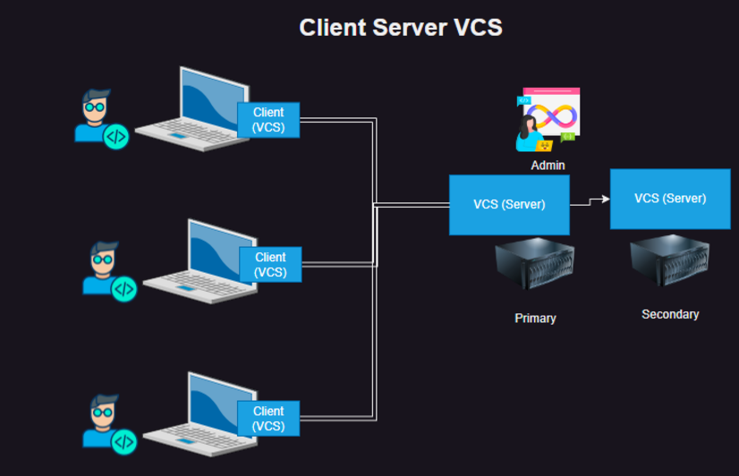

* Distributed: Examples (Mercurial, Git)
 

Git
----

* In Git every system will have a copy of repository
* The Philosiphy of Git is as follows

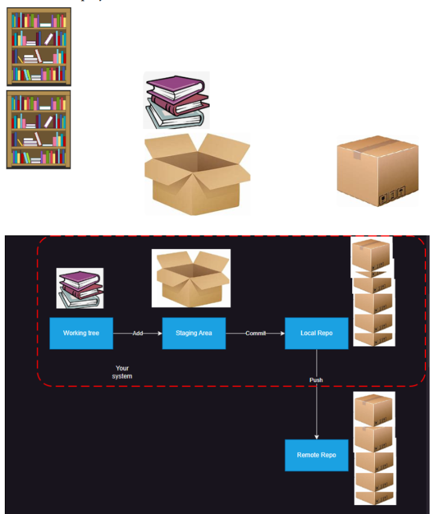

* Git Cheatsheet: https://education.github.com/git-cheat-sheet-education.pdf

Terms
-----

* Artifact: Result of build, but generally refers to the package

* Code Repository: This means we use this to store code and its history

* Artifact Repository: This refers to artifcats and its versions

Exercise
--------

* Try to find what hashing is and why do we use it ?

* What is Hashing in Git?
    * In Git, hashing is a way to create a unique identifier for each change (or commit) you make to your code. This identifier is a long string of letters and numbers, usually 40 characters long, created using a special algorithm called SHA-1.
       
       * Unique ID: Each commit has its own unique hash. Think of it like a fingerprint for that specific change.
       
       * Data Integrity: If you change even a tiny part of the code, the hash will change completely. This helps Git know if something has been altered or corrupted.

       * History Tracking: You can use the hash to find any commit in your project’s history. It helps you see what changes were made, by whom, and when.

* Why Do We Use Hashing in Git?
    * Hashing serves several important purposes in Git:
   
Check for Changes
--------------------
  * Hashes help ensure that your code hasn’t been changed unexpectedly. If something does change, the hash will be different, alerting you to the issue.
    
Keep Track of Versions
------------------------
  * Each time you save a change (commit), Git creates a new hash. This makes it easy to go back to previous versions of your code whenever you need to.
    
Collaboration Made Easy
------------------------- 
  * When multiple people work on the same project, hashes help keep track of everyone’s changes. This way, Git can merge different contributions without confusion.

Automated Builds
-----------------
  * In software development, teams often use automated systems to build and test their code. These systems use hashes to know exactly which version of the code to work with.

Improving Security
------------------
  * While Git has used SHA-1 for a long time, there are plans to move to a stronger hashing method (SHA-256) for better security against potential attacks.
 
In summary: 
-----------
  * hashing in Git is like giving each change a unique name tag that helps keep everything organized, secure, and easy to track!

