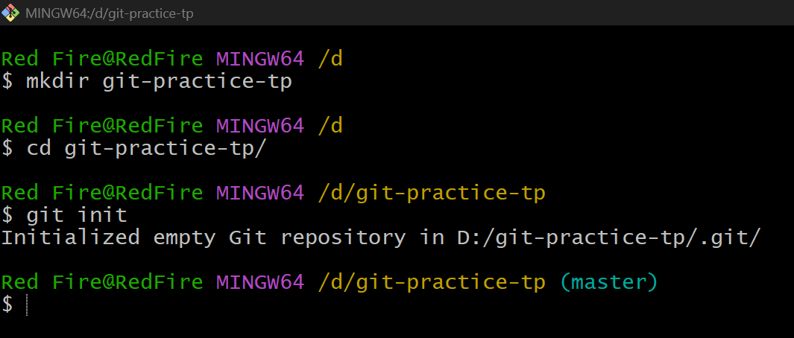
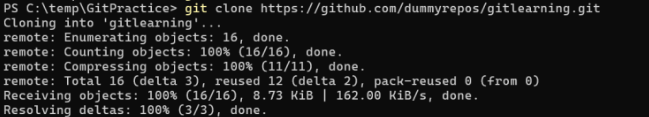
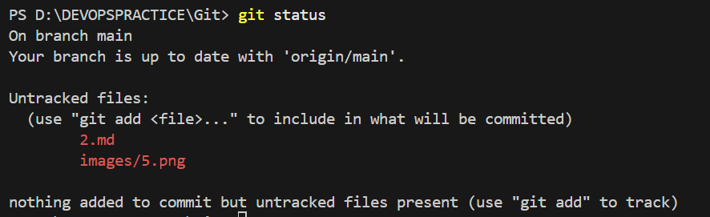
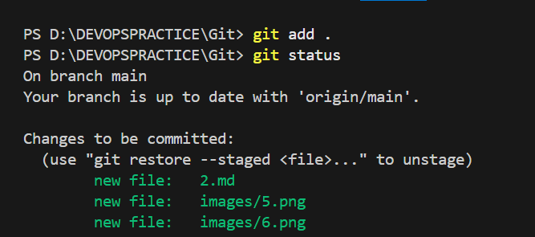
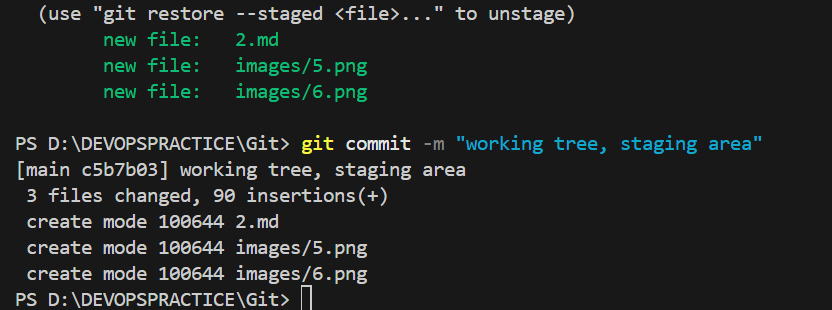
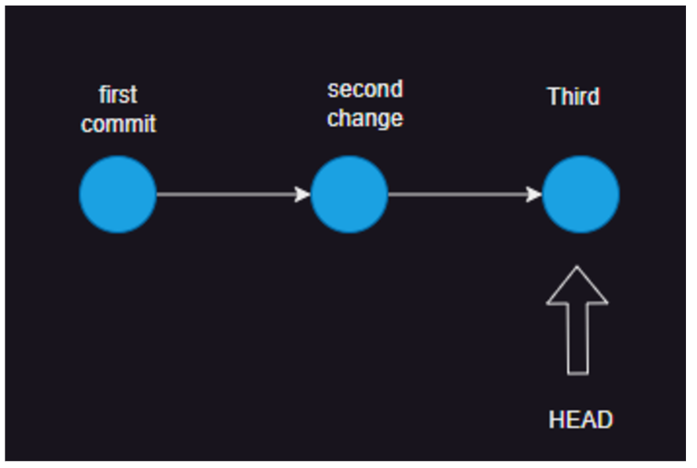

Git (Contd)
-----------

# Git Commit
  
  * Commit needs the following
     * changes
     * username
     * email
     * message
     * datetime (of commit)

# Configuring email and username
    
   * execute the following commands

```
git config --global user.name <username>
 * git config --global user.name "anil"
git config --global user.email <email id>
 * git config --global user.email "paswanil0121@gmail.com" 
```

# Initializing the repository

 * When we want to create a local repository (when remote doesnot exist)
 * Create a new folder
`mkdir <folder name> / mkdir git or mkdir xyz `

 * initailze
```
cd <folder name>
git init
```


# Cloning the repository

 * Your organization is already having the code in some remote location (github)


# Lets focus only on local repo

 * Working tree
 * When we make changes in the working tree, we have two types of status ()
     * untracked: This file doesnot have any history (new file)
     * Changes not staged for commit: These files have history and now are modified
 


* Staging area 


* Now we can commit the changes with a message 


* Git log 


* Graph representation 


* Every commit has a unique commit id

# Hashing and Git

* Git uses hashing and to be specific SHA1 hasing algorithms
* A Git commit is sha 1 hash of
  * changes 
  * previous commit 
  * date time
  * user name and email 
  * message

* Every file which you add to the history is represented as object and contents are stored with hash id 
* Every folder is represented as tree 

# Commands used so far 

 * git config --global user.name <username>
 * git config --global user.email <emailid>
 * git init 
 * git add 
 * git commit
 * git status 
 * git log 
 * git cat-file -p 


