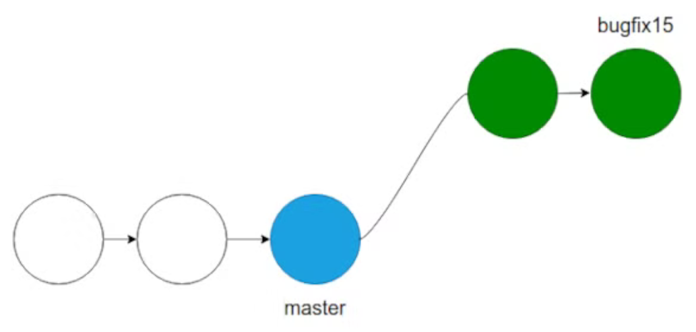
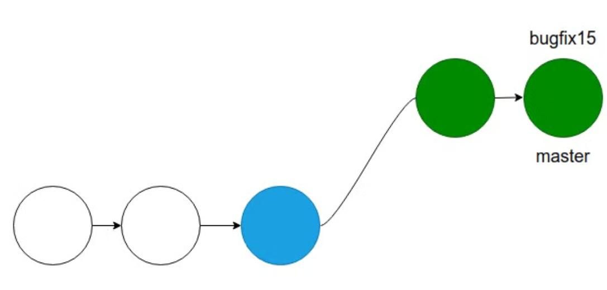
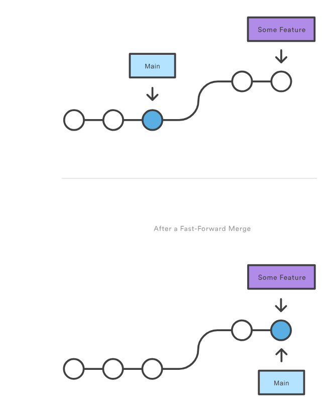
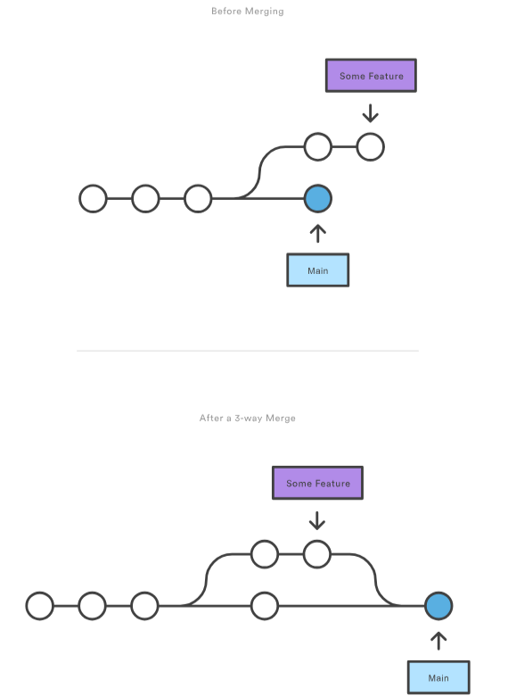
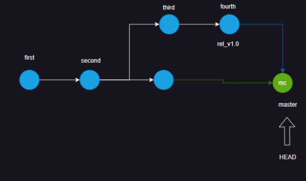
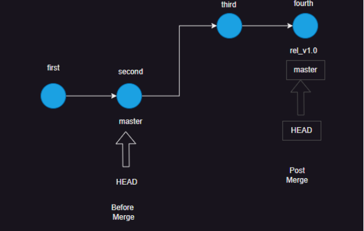

# Git contd

* Reference Objects in Git
    * In  Git we have two reference objects
        * __Branch:__ 
            * This always points to latest commit done
            * The default branch name is master
        
        * __Tag:__
            * This always points to specific commit which is tagged

# Create branches
  
  * 1. To create branches in Git, you can use several commands depending on your needs:
       * Basic Branch Creation: To create a new branch without switching to it, use:
       * `git branch <branch-name>`  = `git branch feature-branch`
    
    2.  Create and Switch: To create a new branch and switch to it immediately, use:
       * `git checkout -b <branch-name>` = `git checkout -b new-feature`

    3. Create from a Tag or Commit: You can also create a branch from a specific tag or commit:
       * git branch <branch-name> <tag-or-commit-id> = `git branch hotfix 4596115`
    
    4. List All Branches:
       * To view all branches in your repository: View Existing Branches: To see all branches in your repository
       * `git branch`
    
    5.  Create a Branch from a Tag:
       * To create a branch from an existing tag:
         `git branch <branch-name> <tag-name>` = `git branch release-branch v1.0`

  
  

# __Fast-Forward Merge__ in Git :
   
   *  A fast-forward merge can occur when there is a linear path from the current branch tip to the target branch. Instead of “actually” merging the branches, all Git has to do to integrate the histories is move (i.e., “fast forward”) the current branch tip up to the target branch tip. This effectively combines the histories, since all of the commits reachable from the target branch are now available through the current one. For example, a fast forward merge of some-feature into main would look something like the following:
   *  A fast-forward merge in Git happens when the branch you want to merge has all its commits ahead of the branch you're merging into, with no new commits on that branch. This means Git can just move the pointer of the target branch forward to include the new changes without making a separate merge commit.
   *  refer:  https://www.howtogeek.com/853521/git-merge/
  
  
  

* refer: https://www.atlassian.com/git/tutorials/using-branches/git-merge 

* # 3-way merges
   
   *  a fast-forward merge is not possible if the branches have diverged. When there is not a linear path to the target branch, Git has no choice but to combine them via a 3-way merge. 3-way merges use a dedicated commit to tie together the two histories. The nomenclature comes from the fact that Git uses three commits to generate the merge commit: the two branch tips and their common ancestor.

   * While you can use either of these merge strategies, many developers like to use fast-forward merges (facilitated through rebasing) for small features or bug fixes, while reserving 3-way merges for the integration of longer-running features. In the latter case, the resulting merge commit serves as a symbolic joining of the two branches.
   * Our first example demonstrates a fast-forward merge. The code below creates a new branch, adds two commits to it, then integrates it into the main line with a fast-forward merge.
```
# Start a new feature
git checkout -b new-feature main
# Edit some files
git add <file>
git commit -m "Start a feature"
# Edit some files
git add <file>
git commit -m "Finish a feature"
# Merge in the new-feature branch
git checkout main
git merge new-feature
git branch -d new-feature
```
* The next example is very similar, but requires a 3-way merge because main progresses while the feature is in-progress. This is a common scenario for large features or when several developers are working on a project simultaneously.
```
Start a new feature
git checkout -b new-feature main
# Edit some files
git add <file>
git commit -m "Start a feature"
# Edit some files
git add <file>
git commit -m "Finish a feature"
# Develop the main branch
git checkout main
# Edit some files
git add <file>
git commit -m "Make some super-stable changes to main"
# Merge in the new-feature branch
git merge new-feature
git branch -d new-feature
```
* Note that it’s impossible for Git to perform a fast-forward merge, as there is no way to move main up to new-feature without backtracking.
* For most workflows, new-feature would be a much larger feature that took a long time to develop, which would be why new commits would appear on main in the meantime. If your feature branch was actually as small as the one in the above example, you would probably be better off rebasing it onto main and doing a fast-forward merge. This prevents superfluous merge commits from cluttering up the project history.

  # Three way merge:
     * This creates an extra commit which has two parents
     * This is generally done when the source branch (to which you want to merge the changes) and destination branch have different paths
     * 

# Fast Forward merge:
   * this does not create extra commit but branch moves ahead
   * This happens in the case when source branch has not changed after target branch creation.


# References:
   
   * __Branches :__ https://www.atlassian.com/git/tutorials/using-branches
   
   * __merge :__  https://www.atlassian.com/git/tutorials/using-branches/git-merge  
 
   * __merge conflict :__ https://www.atlassian.com/git/tutorials/using-branches/merge-conflicts