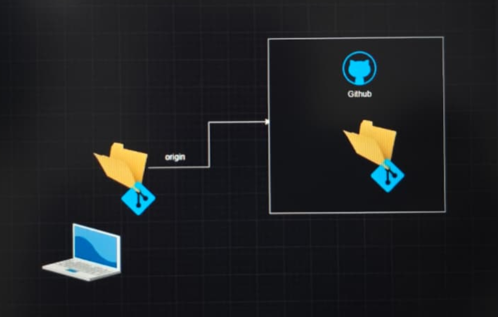
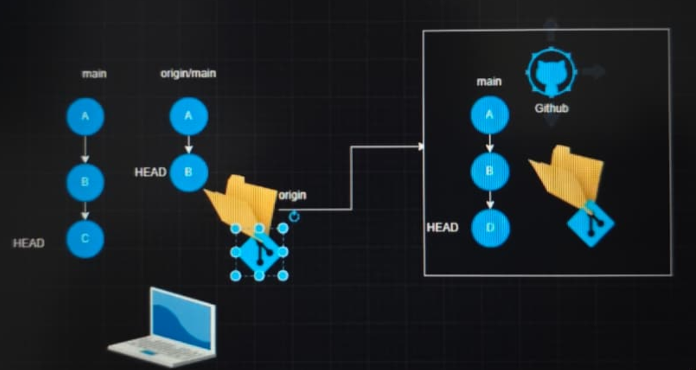
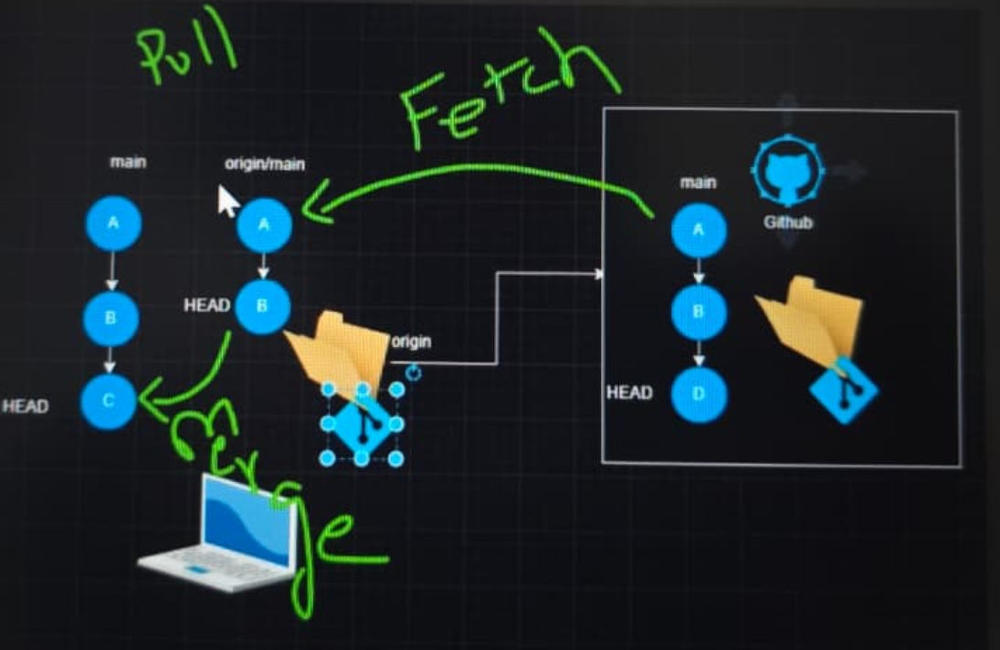
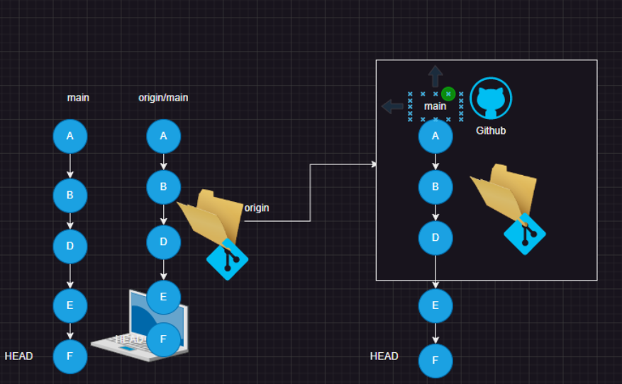

# Git Remote Repository

* What is a Remote Repository?
    * A remote repository is a Git repository that is hosted on another system or server, allowing multiple developers to collaborate and share code.

# Any system can host a Git Remote Repository if it has:

   * Git installed
   * Git daemon (Git server process) running

# Types of Git Remote Repositories

   1. Self-Hosted Repositories
       * These are managed within your own organization or server.
        * Examples:
            * Gitolite
            * GitLab (standalone/on-premises)
   
   2. Cloud-Hosted Repositories
       * These are hosted on third-party cloud services.
        * Examples:
            * GitHub
            * Bitbucket
            * Azure Repos
            * AWS CodeCommit

# Common Commands (when creating local repo first, then connecting remote)

```bash
# Show current branches
git branch 

# Rename the current branch to 'main'
git branch -M main 

# Verify the branch
git branch 

# Add a remote repository (connect local to remote)
git remote add origin https://github.com/username/repo-name.git 

# Check local branches again
git branch 

# Check remote branches
git branch -r 

# Push local 'main' branch to remote repository
git push origin main 

# View commit history
git log
```
* These commands are typically used when you create a local repository first and later connect it to a remote repository.

* This scenario usually happens when you start a project on your local machine and then request a remote repo (e.g., on GitHub or Azure DevOps) to share your work with others.

---

# Prerequisites

1. You have an **Azure DevOps account** and an **organization** (e.g., `myorg`).
2. You have created a **Project** inside the organization (e.g., `MyProject`).
3. Git is installed on your machine.
4. You have either:

   * A **Personal Access Token (PAT)** for HTTPS access, or
   * An **SSH key** added to your Azure DevOps profile if you want to use SSH.

---

# A. Create a Git repo in the Azure DevOps web portal (easy GUI way)

1. Open a browser and go to **dev.azure.com** and sign in.
2. Choose your **Organization** (top-left) → then open the **Project** where you want the repo.
3. In the project left menu click **Repos**.
4. If this is the first repo in the project, you’ll usually see a button **“Create a new repository”**. Otherwise, click the repository dropdown at top-left → **New repository**.
5. Fill the form:

   * **Repository name**: e.g. `my-app`
   * **Type**: Git (default)
   * **Add a README** (optional) — useful for first commit
6. Click **Create**. Done — repo exists in Azure DevOps.

---

# B. Clone the newly created repo (copy to your local machine)

After creating the repo, the portal will show clone instructions. You can choose **HTTPS** or **SSH**.

Example HTTPS clone URL:

```
https://dev.azure.com/myorg/MyProject/_git/my-app
```

Run:

```bash
git clone https://dev.azure.com/myorg/MyProject/_git/my-app
cd my-app
```

When asked for credentials over HTTPS, use your **username** (any text works) and the **PAT** as the password. Or configure credential helpers so you don’t re-enter the PAT each time.

For SSH, the URL looks like:

```bash
git@ssh.dev.azure.com:v3/myorg/MyProject/my-app
```

(Works if you uploaded your public SSH key to Azure DevOps.)

---

# C. Push an existing local project to Azure DevOps (if you already have code)

If you have a local folder with code and want to push it into the new Azure DevOps repo:

1. In your project folder:

```bash
cd /path/to/your-project
git init
git add .
git commit -m "Initial commit"
```

2. Add the Azure repo as `origin` and push:

```bash
git remote add origin https://dev.azure.com/myorg/MyProject/_git/my-app
git branch -M main        # rename master to main (optional)
git push -u origin main
```

You’ll be asked for credentials (use PAT) or it will use SSH if you used the SSH URL.

---

# D. Create a repo directly from Azure CLI (optional, for automation)

If you prefer CLI (helpful for scripts), you can create repos from the Azure DevOps CLI extension. Example (conceptual):

```bash
# login, install devops extension first (once)
az login
az extension add --name azure-devops

# set defaults (organization and project)
az devops configure --defaults organization=https://dev.azure.com/myorg project=MyProject

# create repo
az repos create --name my-app
```

(You might need to authenticate and configure PAT for the CLI as well.)

---

# E. Branching, Pull Requests, and basic workflow (simple)

1. Create a branch locally:

```bash
git checkout -b feature/add-login
# make changes...
git add .
git commit -m "Add login feature"
git push -u origin feature/add-login
```

2. In Azure DevOps portal → **Repos → Pull requests** → **New pull request**.

   * Pick your source branch `feature/add-login` and target `main`.
   * Add reviewers and create PR.

3. Reviewers leave comments, you make fixes, push them to the same branch, and the PR updates.

4. Once approved, **Complete** the PR to merge into `main`. Optionally enable **squash** or **complete linked work items**.

---

# F. Protecting `main` with branch policies (recommended for teams)

1. In the portal: **Repos → Branches**. Find `main` → click the three dots → **Branch policies**.
2. Enable policies like:

   * Require one or more reviewers before merge.
   * Require successful build (CI pipeline) before merge.
   * Require no merge conflicts.
3. Save — this ensures quality and prevents direct pushes to `main` (if you enforce it).

---

# G. Add collaborators / permissions

1. Project settings → **Repositories** → choose repo → **Security**.
2. Add users or groups and set permissions (Contribute, Read, Branch create, etc.).
3. Or add users to the project with appropriate roles in **Project settings → Permissions**.

---

# H. Common troubleshooting tips

* **Authentication errors**: If HTTPS fails, create a PAT (go to your profile → Personal access tokens) with `Code (read & write)` scope and use it as the password.
* **SSH issues**: Make sure your public key is uploaded to Azure DevOps profile and the private key is loaded into your ssh-agent.
* **Remote URL wrong**: `git remote -v` to inspect. Use `git remote set-url origin <URL>` to fix.
* **Force-push caution**: Don’t force-push to shared branches (`main`) unless you know what you’re doing.

---

# Quick checklist (one-line summary)

1. Create project in Azure DevOps.
2. Create new Git repo in Repos → New repository.
3. Clone repo locally or `git init` existing code.
4. Add remote (`origin`) and `git push -u origin main`.
5. Use branches and PRs for changes.
6. Protect `main` with branch policies.
7. Add collaborators and set permissions.

---

* A local Git repository can be connected to a remote repository. This connection is created automatically when you clone a remote repository.   However, if you create the local repository first and the remote later, 
* you can connect them manually using the command: `git remote add <name> <url>`

* A local Git repository can be connected to multiple remote repositories, but this is rare.
* In most organizations, the remote repository is created first, and developers simply clone it to their local systems. This is the most common workflow, because teams usually work on existing projects stored in a central remote repository.
* However, sometimes the opposite happens — you create a local repository first and later connect it to a new remote repository.

# Example (real-time scenario):

* Suppose you are a developer starting a brand-new project on your local machine because no remote repository exists yet. You write some initial code, test it, and once it’s ready to share with your team, you ask your lead or admin to create a remote repository in Azure DevOps or GitHub.
* After they create it, you connect your local repo to the new remote using:

```bash
git remote add origin <remote_repo_URL>
git push -u origin main
```
* From that point, your project becomes part of the central repository, and other team members can clone it and start contributing.

# Concept of push and Pull

* Git works with two repositories:
    1. Local repository → on your own computer.
    2. Remote repository → on a server (like Azure DevOps, GitHub, GitLab, etc.).

* Both need to stay in sync — that’s where push and pull come in.

# git push

   * Push = send your changes from local to remote repo.
   * When you run:

```bash
git push origin main
```

# It means:
 * Fetch and merge the latest changes from the remote `main` branch into my local branch.

# Example (real-time scenario):

   * Your teammate pushed new code to the remote repo.
   * Before you start working or pushing your own changes, you use `git pull` to get their latest updates to avoid conflicts.


# Summary Table

| Command    | Direction      | Meaning                                               | When to Use                                        |
| ---------- | -------------- | ----------------------------------------------------- | -------------------------------------------------- |
| `git push` | Local → Remote | Upload your local commits to the central repository   | After committing your work                         |
| `git pull` | Remote → Local | Download and merge changes from the remote repository | Before starting new work or before pushing changes |


# Common Practice

 * Always pull before pushing to make sure your local repo is up to date.
 * If there’s a conflict, Git will ask you to resolve it manually before you can push again.

1. Basic Push to GitHub

 

* we have a folder with code on your laptop (local repository). There’s a copy of this on GitHub (remote repository). When we use git push, we are sending our changes from your computer to GitHub.
* Example: You finish your homework (code) and want to store it online, so you ‘upload’ it to GitHub using Git.

```bash
git add .
git commit -m "My changes"
git push origin main
```
2. Local and Remote Commit History



* Let's break down this scenario where your local repository (on your laptop) has the commits: A → B → C, and the remote repository (on GitHub) has the commits: A → B → D.

* Example Scenario
    * You: Add a new feature (commit C) on your laptop.
    * Your Friend: Adds a different feature (commit D) directly on GitHub.
    * Goal: Combine both C and D so neither is lost, and both are included in the final project on GitHub.

```bash
Local (your laptop):    A --- B --- C  (main)
Remote (on GitHub):     A --- B --- D  (origin/main)
```

* Commands to Sync and Combine Changes
    * Check your current branch status: `git status`
    * See what your local commit history looks like: `git log --oneline --graph --all`
    * Get your friend's latest changes from GitHub: `git fetch origin`
    * This updates your view of GitHub's main branch (does NOT modify your code yet).

    * Merge your friend's changes into your local work: `git merge origin/main`
    * Now your main branch will contain A, B, C, and D – any conflicts can be resolved at this point
    * If you want to do steps 3 and 4 in a single command: `git pull origin main`
    
    * Once all is merged and tested, upload the combined work to GitHub: `git push origin main`

* How This Looks with Commits
    * After you merge:

```bash

A --- B --- C
           \
             D
              \
               (merge commit)

```
* Your history will show both your change (C) and your friend's (D), creating a new commit that records the merge

* Summary:
    * Always fetch and merge (git pull or git fetch + git merge) before pushing if you know others are changing the project too.
    * This keeps all features from everyone included, and avoids overwriting or losing each other's work.
 
# or 

Yes, you can use `git pull --rebase` in this situation to combine your local changes (commit C) with the remote changes (commit D) that your friend made on GitHub.[1][2][8]

### How Does `git pull --rebase` Work Here?

- When you run:
  ```bash
  git pull --rebase origin main
  ```
  Git will:
  - Fetch the latest commits from the remote repository (getting D from GitHub).
  - Temporarily set aside your local commit(s) (C).
  - Apply the remote commits (D) onto your local branch.
  - Reapply your local commit(s) (C) on top of the updated branch, as if you made your changes after your friend’s.[2][8][1]

### Why Use Rebase? (Instead of Merge)

- **Cleaner History:** Your project history remains a straight line, without extra "merge commits."
- **Makes it Look Like:** You built your C change after your friend’s D, making the sequence: A → B → D → C (instead of A → B → C and D with a merge-combine).

### Example Workflow for Your Case

You made commit C, your friend pushed D on GitHub. To sync with a tidy history:
```bash
git pull --rebase origin main
```
- If there are any conflicts, Git will tell you to resolve them and then use:
  ```bash
  git rebase --continue
  ```
- Once the rebase is done, push your commits:
  ```bash
  git push origin main
  ```

This is especially helpful to keep commit history simple and linear on shared projects.[5][8][1][2]

[1](https://stackoverflow.com/questions/36148602/git-pull-vs-git-rebase)
[2](https://graphite.dev/guides/git-pull-vs-rebase)
[3](https://www.reddit.com/r/git/comments/xxbxhq/git_rebase_vs_git_pull_rebase/)
[4](https://www.linkedin.com/pulse/git-pull-vs-rebase-shaharyar-saleem)
[5](https://binarysiddhant.hashnode.dev/demystifying-git-pull-rebase-and-git-pull-no-rebase)
[6](https://about.gitlab.com/blog/git-pull-vs-git-fetch-whats-the-difference/)
[7](https://www.youtube.com/watch?v=kxrkcK18_f4)
[8](https://www.atlassian.com/git/tutorials/merging-vs-rebasing)

* The choice between `git pull --rebase` and regular `git pull` depends on your project’s needs and your team’s workflow.[1][2][3]

### When to Use `git pull --rebase`

- **Cleaner history:** It keeps your commit timeline linear, making it easier to follow who did what and when.
- **Best for solo work or small, collaborative teams** who value simple histories over tracking merge points.
- **Preferred for feature branches:** Rebasing makes it easy to integrate your work before merging into the main project.

### When to Use Regular `git pull`

- **Automatic merge commits:** It records where branches were combined, helpful for big teams or projects with lots of contributors.
- **Best for teams** that want to preserve the record of branching and merging, especially on shared branches.

### Real-World Advice

- Use `git pull --rebase` for personal branches to keep a tidy history.
- Use regular `git pull` for main/shared branches, or when merge commits are important for tracing work.

**Summary:**  
If you want a clean, straight project history: use `git pull --rebase`.  
If you value the ability to see where work was merged: use regular `git pull`.[2][3][1]

[1](https://stackoverflow.com/questions/36148602/git-pull-vs-git-rebase)
[2](https://graphite.dev/guides/git-pull-vs-rebase)
[3](https://www.atlassian.com/git/tutorials/merging-vs-rebasing)


Here is a step-by-step explanation of the third image (Fetch, Pull, Merge process), now including the actual Git commands and a clear example:[1][5][7][9]

***

### Explanation



- **Fetch** gets the latest changes from GitHub to your computer but does not mix them with your own work yet.
- **Pull** gets the latest changes AND automatically combines them into your local code.
- **Merge** is the process of combining your local changes and your friend's changes so everyone’s work is included and up-to-date.

***

### Commands for Each Step

1. **Fetch (just download changes):**
    ```
    git fetch origin
    ```
    - Downloads changes from GitHub into your local “origin/main” branch, does NOT update your actual code yet.

2. **See the difference:**
    ```
    git log main..origin/main
    ```
    - Shows what commits are on GitHub that you don't have in your branch yet.

3. **Merge (combine changes):**
    ```
    git merge origin/main
    ```
    - Combines your local work with the changes fetched from GitHub.

4. **Combine in one go (Pull):**
    ```
    git pull origin main
    ```
    - Shortcut: This command fetches and merges in one step.

***

### Real-Life Example

Imagine you make a change called "C" on your laptop’s code. Meanwhile, your friend pushes a change "D" to GitHub.

- You run `git fetch origin` to download "D" into your computer.
- You run `git merge origin/main` to combine "C" (your work) and "D" (your friend's work).
- Alternatively, `git pull origin main` does both fetch and merge in one step.

Now, your project has both changes and is ready for the next push back to GitHub.

***

These commands support smooth teamwork so you and your friend never lose anyone’s work and keep your project current and organized.[5][7]

[1](https://www.atlassian.com/git/tutorials/syncing/git-fetch)
[2](https://stackoverflow.com/questions/14004539/git-workflow-pull-vs-fetch)
[3](https://www.atlassian.com/git/tutorials/comparing-workflows/gitflow-workflow)
[4](https://gist.github.com/blackfalcon/8428401)
[5](https://www.geeksforgeeks.org/git/what-is-git-pull/)
[6](https://www.youtube.com/watch?v=6cn0c-2n6G0)
[7](https://www.educative.io/blog/git-fetch-vs-pull)
[8](https://www.linkedin.com/posts/venkatesh-naidu-46b59437_git-workflow-diagram-visualizes-the-core-activity-7336094928239849473-VizP)
[9](https://ppl-ai-file-upload.s3.amazonaws.com/web/direct-files/attachments/images/58827319/c11f9f19-9308-425d-8d8c-0f8aa374234a/image.jpg)


4. This image breaks down a complete Git collaboration workflow, showing every step and why each commit happens, using a realistic team project example.[1]




### Detailed Explanation of Each Commit

#### 1. **Commit A** — Initial Project Setup
- **What:** The very first commit, such as adding a README or basic files.
- **Why:** Every project needs an initial setup so everyone starts from the same foundation.
- **Example:** You create a new project for a school website: you commit the base folder and instructions.

#### 2. **Commit B** — First Feature or Update
- **What:** Someone (you or a teammate) adds basic features, like a homepage layout.
- **Why:** Teams build step-by-step; this step adds the first real function.
- **Example:** Your friend adds a homepage HTML file and pushes this to GitHub.

#### 3. **Commit D** — Feature From a Teammate
- **What:** A team member (not you) adds another feature, such as a contact form, and pushes to GitHub.
- **Why:** Parallel development is common. D appears in 'origin/main' and on GitHub before you fetch it.
- **Example:** Your partner adds a contact page and pushes it while you’re working locally.

#### 4. **Commit E** — Your Next Update, After Syncing
- **What:** You fetch D and then add your next feature, like a navigation bar.
- **Why:** You want your new work to use the most up-to-date code, including your friend’s additions.
- **Example:** You get the latest code from GitHub (`git fetch`), then add a navbar as commit E.

#### 5. **Commit F** — Final Touches or Fixes
- **What:** You make further improvements, such as fixing a bug or finalizing page design.
- **Why:** Final dev steps ensure the project is polished and issues are resolved.
- **Example:** Fixing a button or updating styling becomes your commit F.

***

### Visualization in the Image

- **Left Side (main, on your laptop):**  
  Shows the commit chain as you’ve developed locally:  
  A → B → D → E → F.
- **Middle (origin/main):**  
  Matches the remote version after fetching updates and making your changes.
- **Right Side (GitHub/main):**  
  Once you push, GitHub matches your history exactly, signifying all work is unified.
- **HEAD:**  
  Points to the latest commit in each branch.

***

### Real-Time Scenario

Imagine two students, Anna and Ben:
- Anna starts with A and B.
- Ben is working separately and adds D (contact form) to GitHub.
- Anna grabs Ben’s work (`git fetch`), then adds her own E (navbar) and F (bugfix), and finally pushes everything.
- Now, both Anna and Ben have a project on their computers AND on GitHub with all changes included.

***

### Process as a Simple Diagram

```
Anna's steps:   A → B        (starts project, homepage)
Ben’s update:             D  (adds contact form online)
Anna fetches:  A → B → D     (gets Ben’s code, updates her copy)
Anna adds:            E, F   (adds navbar, fixes bug)
Anna pushes:   A → B → D → E → F  (everyone is now in sync)
```

***

When you follow these steps, you ensure that every piece of your teammates’ work and your own improvements are saved, combined, and visible for everyone in the group—both locally and on GitHub.[1]

